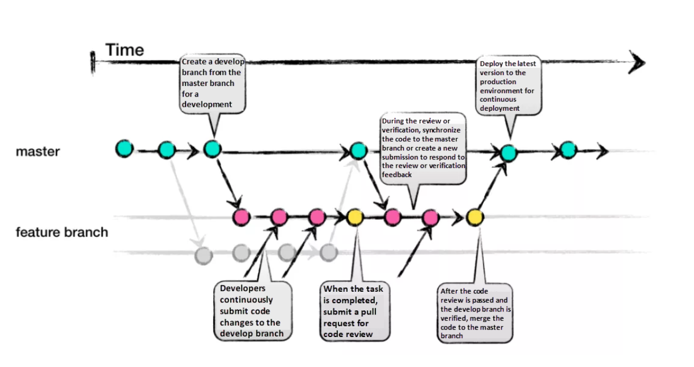

### 브랜치 전략
브랜치 전략은 **[GitHub Flow](https://docs.github.com/en/get-started/using-github/github-flow)** 를 기본적으로 따른다. 

1. 브랜치 생성  
   새로운 브랜치를 생성할 수 있는 브랜치는 master(main)브랜치뿐 입니다.  
   브랜치의 생성은 작업 단위로 이루어집니다.  
   브랜치의 이름에는 규약이 없으며, 작성하고 있는 작업을 잘 나타내는 이름으로 한글/영어 상관없이 지정하면 됩니다.  

2. 커밋과 푸시  
    커밋과 푸시는 작업중 수시로하여 다른 조원이 작업의 현황을 알 수 있도록 합니다.  
    커밋의 이름은 한글/영어 상관없으며 작성한 코드의 동작을 잘 나타내는 이름으로 지정합니다.  
    master(main)브랜치로의 직접적인 커밋/푸시는 금지합니다.  
    예외적으로 문서에 대한 수정은 master(main)브랜치에 직접적으로 커밋/푸시하는것을 허용합니다. 

3. Pull Request  
    단일 작업(브랜치)에 대한 작성이 모두 완료되면 팀장의 코드리뷰(팀장의 PR은 팀원 1명)를 통한 검토와 피드백을 시행한다.  
    master(main)브랜치는 항상 배포가능한 상태를 유지해야 합니다. 
   
### 작업 분배
1. 작업의 생성
    프로젝트에 필요한 작업이 있다는 생각이 들면 [TODO List](morningstar-library/Docs/TODO%20List.md)의 미할당 과제 목록의 해당하는 항목에 작업을 적는다.  
    예시: 책 정보에 대한 데이터베이스 insert문 작성: 미할당 과제 > 데이터베이스에 추가  
    작업의 추가는 되도록 우선순위가 높은 것을 위에 적는 것으로 한다. 

1. 작업 시작
    작업을 시작하기 위해서는 미할당 과제의 목록중에 하려는 작업을 자신의 목록에 옮기고 시작하면 된다.  
    모든 작업은 체크박스로 목록을 만들고 작업을 완료하고 병합까지 완료를 하면 체크박스를 체크한다.  
    프로젝트가 끝나면 작업목록은 프로젝트의 기여도를 측정하기 위한 참고자료로 사용할 것  

1. 작업의 분할
    미할당 과제 목록중에 한번에 해결하기 어렵다고 생각되는 작업이 있으면 자유롭게 분할 가능하다.  
    예시:  
    작업 분할 전  
    - [ ] 도서 데이터베이스 클래스 작성 (작업의 단위가 너무 크다.)  

    작업 분할 후
    - [ ] 도서 데이터베이스 클래스 작성
      - [ ] 도서 클래스의 프로퍼티 작성
      - [ ] 도서 등록 메서드 작성  
      등등...
    
    위의 예시에서 "도서 등록 메서드 작성" 작업을 하고자 하면 다음과 같이 작업을 옮긴다. 
    - [ ] 도서 데이터베이스 클래스 작성
      - [ ] 도서 등록 메서드 작성   
    
    자신의 작업이 끝나면 "도서 등록 메서드 작성"에 체크한다.  
    "도서 데이터베이스 클래스 작성"의 마지막 기능이 완성되면, 완성한 사람이 다른 사람들의 작업 리스트도 갱신한다. 

작업의 생성, 시작은 누구의 허락없이 자율적으로 진행하면 된다. 
